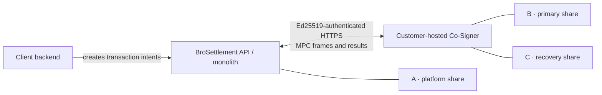

# BroSettlement MPC Co-Signer

[](https://go.dev/)
[](LICENSE)

A customer-hosted co-signing service for 2-of-3 threshold signatures. It holds
two of the three key shares—primary and recovery—and participates in
multi-party computation so transactions can be signed without any single party
ever holding a complete private key.

The service is built for BroSettlement and uses threshold ECDSA over secp256k1,
implemented with the GG18 protocol through
[`bnb-chain/tss-lib`](https://github.com/bnb-chain/tss-lib). It polls
BroSettlement for signing work, exchanges MPC protocol frames, and publishes
the final result back to the platform.

## How it works



The client backend initiates wallet and transaction operations, but it is not
itself an MPC party. The three MPC parties are the BroSettlement platform share
and the two purpose-bound shares managed by the Co-Signer:

- **Distributed key generation:** A + B + C participate in GG18 DKG.
- **Normal signing:** A + B form the production 2-of-3 quorum.
- **Recovery quorum:** B + C can sign without A. V1 verifies this path in an
  isolated recovery proof, but does not provide a supported recovery CLI or
  SDK.

Because the Co-Signer host contains both B and C, it is a quorum-bearing trust
domain. Treat access to the host, both artifact stores, and their shared
encryption key as security-critical.

For the wider product and integration model, see the
[BroSettlement documentation](https://www.brolabel.io/en/api-reference/brosettlement)
and the [Co-Signer guide](https://www.brolabel.io/en/api-reference/co-signer).

## Quickstart

### Prerequisites

- Go 1.24 or newer
- OpenSSL for the example share-encryption key command
- A BroSettlement environment and an Ed25519 API key with the `mpc:raw` scope

The public API reference currently documents the staging base URL. Use the URL
and credentials issued for your environment in production. See
[API authentication](https://www.brolabel.io/en/api-reference/authentication)
for the Ed25519 key and request-signing contract.

### Build

```bash
git clone https://github.com/BroLabel/brosettlement-mpc-co-signer.git
cd brosettlement-mpc-co-signer

GOWORK=off go mod download
mkdir -p bin
GOWORK=off go build -o ./bin/co-signer ./cmd/co-signer
```

### Configure

Create two separate private artifact directories:

```bash
install -d -m 0700 "$PWD/.local/co-signer/primary"
install -d -m 0700 "$PWD/.local/co-signer/recovery"
```

Set the required environment variables. Generate
`CO_SIGNER_SHARE_ENCRYPTION_KEY` once, store it in a secrets manager, and keep
the same value and key ID for the lifetime of every encrypted artifact.

```bash
export CO_SIGNER_MONOLITH_URL="https://brosettlement-staging-api.brolabel.io"
export CO_SIGNER_API_KEY_ID="<api-key-id>"
export CO_SIGNER_API_PRIVATE_KEY="<Ed25519 PKCS#8 PEM, hex, or Base64 private key>"

export CO_SIGNER_PRIMARY_SHARES_DIR="$PWD/.local/co-signer/primary"
export CO_SIGNER_RECOVERY_SHARES_DIR="$PWD/.local/co-signer/recovery"
export CO_SIGNER_SHARE_ENCRYPTION_KEY="$(openssl rand -base64 32)"
export CO_SIGNER_SHARE_ENCRYPTION_KEY_ID="local-dev-v1"
```

The service also loads a local `.env` file. Never commit `.env`, API private
keys, share-encryption keys, or generated share artifacts.

### Run

```bash
./bin/co-signer
```

The health and Prometheus metrics endpoints listen on port `8081` by default:

```bash
curl -i http://127.0.0.1:8081/health
curl -sS http://127.0.0.1:8081/metrics
```

`/health` can return `503 Service Unavailable` while startup reconciliation or
DKG pre-parameter preparation is still in progress. Its JSON response reports
process, signing, and provisioning readiness separately.

## Runtime model

Once started, the Co-Signer:

1. polls the BroSettlement monolith for organization-scoped DKG and signing
   intents;
2. claims work with Ed25519-authenticated HTTP requests;
3. runs the local primary and recovery parties and exchanges MPC frames through
   the monolith relay;
4. persists encrypted, immutable key-share artifacts after DKG;
5. publishes completed, failed, or timed-out MPC results back to the monolith.

Run exactly one active Co-Signer installation per organization. Two
installations using the same organization credentials can claim or replay the
same work and cause a self-inflicted availability failure. During upgrades,
stop the old process before starting the new one.

## Configuration

### Required variables

| Variable | Description |
| --- | --- |
| `CO_SIGNER_MONOLITH_URL` | BroSettlement base URL, without a trailing `/api/v1` path. |
| `CO_SIGNER_API_KEY_ID` | ID of an Ed25519 API key authorized for Co-Signer operations. |
| `CO_SIGNER_API_PRIVATE_KEY` | Ed25519 private key as PKCS#8 PEM, 32- or 64-byte hex, or standard Base64. |
| `CO_SIGNER_PRIMARY_SHARES_DIR` | Absolute, pre-existing private directory for primary B artifacts. |
| `CO_SIGNER_RECOVERY_SHARES_DIR` | Absolute, pre-existing private directory for recovery C artifacts; it must not equal or overlap the primary directory. |
| `CO_SIGNER_SHARE_ENCRYPTION_KEY` | Canonical padded standard Base64 encoding of exactly 32 random bytes. |
| `CO_SIGNER_SHARE_ENCRYPTION_KEY_ID` | Stable printable ASCII identifier, 1–255 bytes, for the encryption-key reference. |

### Optional variables

| Variable | Default | Description |
| --- | --- | --- |
| `CO_SIGNER_HTTP_ADDR` | `0.0.0.0:8081` | Health and metrics listen address. If unset, `PORT` is honored. |
| `CO_SIGNER_MAX_CONCURRENT` | `4` | Maximum number of concurrent MPC jobs. |
| `CO_SIGNER_POLL_MIN_INTERVAL` | `2s` | Minimum actionable-intent polling interval. |
| `CO_SIGNER_POLL_MAX_INTERVAL` | `10s` | Maximum polling interval after backoff. |
| `CO_SIGNER_POLL_BACKOFF_FACTOR` | `1.5` | Polling backoff multiplier. |
| `CO_SIGNER_FRAME_POLL_INTERVAL` | `500ms` | Interval used to poll for inbound MPC frames. |
| `CO_SIGNER_HTTP_TIMEOUT` | `30s` | Timeout for BroSettlement HTTP requests. |
| `CO_SIGNER_PREPARAMS_GENERATION_PARALLELISM` | `2` | Number of GG18 pre-parameter generation workers. |

The process lifetime lock is always stored at
`<CO_SIGNER_PRIMARY_SHARES_DIR>/.co-signer.lock`; it is not independently
configurable. Legacy `CO_SIGNER_PARTY_ID`, `CO_SIGNER_SHARES_DIR`,
`CO_SIGNER_SHARE_ENCRYPTION_KEY_REF`, `CO_SIGNER_STATE_DIR`, and
`CO_SIGNER_LOCK_PATH` settings are unsupported and cause startup validation to
fail.

## Artifact custody and recovery

The primary and recovery stores use one in-memory AES-256 key provider and the
same stable key reference. The raw encryption key is never returned by store
configuration or written to logs. Back up the original key, its reference, and
both artifact directories together; v1 has no passphrase hashing, key rotation,
re-encryption, or old-key lookup.

Immutable artifact publication is supported on Linux and macOS. Production
operations remain Linux-only; macOS support is intended for local development
and verification.

Read the following before operating the service:

- [Artifact format v1](docs/artifact-format-v1.md)
- [Recovery artifact runbook](docs/runbooks/recovery-artifact.md)
- [Security policy](SECURITY.md)

## Client API request signing

The Co-Signer authenticates monolith HTTP requests with Ed25519 signatures. The
canonical request contains exactly six newline-separated lines:

```text
METHOD
EXACT_REQUEST_TARGET
BODY_HASH
TIMESTAMP
NONCE
API_KEY_ID
```

- `METHOD` is the uppercase HTTP method.
- `EXACT_REQUEST_TARGET` is the value of `req.URL.RequestURI()` after the URL is
  fully constructed. Query parameter order, repeated and empty values, and
  percent encoding are preserved exactly.
- `BODY_HASH` is the lowercase hexadecimal SHA-256 digest of the exact request
  body bytes. It is an empty line for requests without a body.
- `TIMESTAMP`, `NONCE`, and `API_KEY_ID` match the corresponding API-signing
  headers and configured key ID.

`X-Api-Body-Hash` is sent only when a body is present.
`X-Idempotency-Key` is not part of the canonical request. Each retry constructs
and signs a new request with a fresh timestamp and nonce.

## Development

Run the regular test and contract suites with workspace discovery disabled:

```bash
GOWORK=off go test ./...
GOWORK=off go run ./cmd/mpc-contracts verify
```

The full Linux-only verification includes race tests, filesystem crash
evidence, fuzzing, an isolated B+C recovery proof, and a production build:

```bash
make verify-mpc-2of3
```

Contributions are welcome. Please read [CONTRIBUTING.md](CONTRIBUTING.md) and
report sensitive findings according to [SECURITY.md](SECURITY.md).

## License

Licensed under the [Apache License 2.0](LICENSE).
